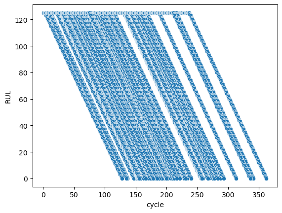
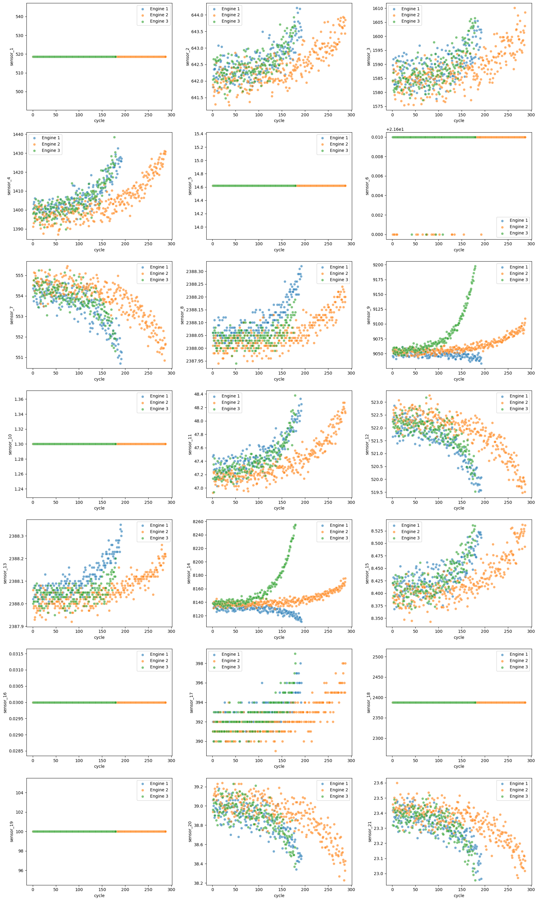
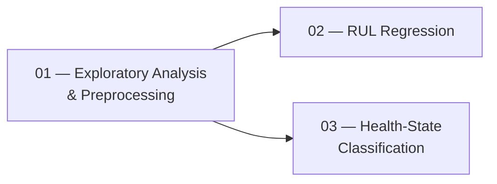
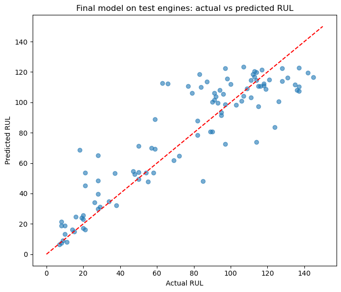
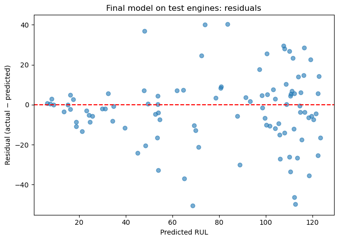
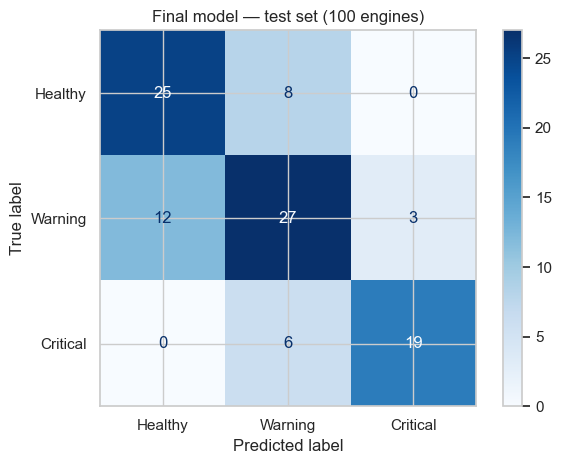

# NASA C-MAPSS Aircraft Engine Health & RUL Prediction


> **Status:** Completed — benchmark ML study

End-to-end machine learning study of **predictive maintenance for aircraft turbofan engines**, using NASA's **C-MAPSS** simulated run-to-failure dataset (FD001). The project covers two complementary problems on the same sensor data:

- **Remaining Useful Life (RUL) regression** — how many operating cycles does an engine have left?
- **Health-state classification** — is the engine *Healthy*, in *Warning*, or *Critical*? An early-warning view built on the same signals.

> **Notebooks:** [01 — Exploratory Analysis & Preprocessing](01_analysis.ipynb) · [02 — RUL Regression](02_regression.ipynb) · [03 — Health-State Classification](03_classification.ipynb)

---

## Overview

Aircraft engines degrade with every operating cycle, and unscheduled failure is one of the most expensive events in fleet operations. **Prognostics / predictive maintenance** aims to estimate how much usable life remains *before* failure, so that maintenance can be scheduled instead of reacted to.

This project studies that problem with the NASA C-MAPSS benchmark: simulated turbofan trajectories that run from healthy operation to failure, with 21 sensor measurements recorded per cycle. Two ML formulations are explored on identical, leakage-controlled features:

1. **RUL regression** gives a continuous estimate of remaining cycles — the quantitative input for maintenance planning. It preserves granularity ("~45 cycles left"), but a raw number is hard to operationalize directly.
2. **Health-state classification** converts the problem into three actionable severity bands. This is the early-warning view: the classifier's job is to *not miss* engines approaching failure, even at some cost in overall accuracy.

The two tasks share data, preprocessing, and physical intuition — and the comparison between them (what each formulation reveals and what it hides) is part of the story the notebooks tell.

**Scope:** this is a benchmark study on simulated data, not a deployed maintenance system.

## Key Results

- **RUL regression:** the tuned Random Forest achieved a test **MAE of 13.14 cycles**, RMSE of **17.96**, and **R² of 0.81** on the 100 held-out test engines.
- **Health-state classification:** Logistic Regression achieved **0.76 Critical Recall** and **0.86 Critical Precision** on the test engines — and never dismissed a Critical engine as Healthy.
- **Leakage control:** engine-level splitting and engine-grouped cross-validation (`GroupKFold` by engine ID) were used throughout model development; the official test set was evaluated exactly once.
- **Main limitation:** the study uses simulated FD001 data with a single operating condition and a single degradation mode.

## Project at a Glance

| | |
|---|---|
| **Dataset** | NASA C-MAPSS, subset **FD001** (files via the [Kaggle mirror](https://www.kaggle.com/datasets/behrad3d/nasa-cmaps)) — 100 training engines run to failure (20,631 cycles), 100 test engines truncated before failure, 21 raw sensor measurements + 3 operating settings per cycle (16 modeling features after pruning) |
| **Domain** | Predictive maintenance / prognostics for turbofan engines |
| **Tasks** | RUL regression · 3-class health-state classification (Healthy / Warning / Critical) |
| **Models** | Linear Regression & Logistic Regression baselines · Random Forest · Gradient Boosting · XGBoost · SVR |
| **Evaluation** | MAE, RMSE, R², asymmetric NASA (PHM'08) score for regression; Balanced Accuracy, Macro F1, Critical precision/recall for classification |
| **Leakage control** | Engine-level train/validation split · engine-grouped CV for tuning · scaler fitted on train only · test set used exactly once |
| **Headline results** | Regression — test **MAE 13.14 cycles**, RMSE 17.96, R² 0.81, NASA 8.13 (tuned Random Forest) · Classification — test **Critical Recall 0.76**, Critical Precision 0.86 (Logistic Regression) |
| **Tools** | Python, pandas, NumPy, scikit-learn, XGBoost, matplotlib, seaborn, Jupyter |

## Problem Formulation

### Task 1 — RUL Regression

- **Input:** one engine snapshot — a single cycle of 16 standardized features (2 operating settings + 14 informative sensor channels).
- **Output:** Remaining Useful Life in operating cycles.

For training engines, which run to failure, the label is computed directly:

```text
RUL = max cycle of the engine − current cycle
```

A purely linear target is hard to learn early in life, where degradation is buried in noise. Training RUL targets are therefore **clipped at 125 cycles**, following the commonly used piecewise-linear RUL labeling convention for C-MAPSS (Heimes, 2008). The cap is a fixed modeling choice made a priori and is **not tuned using validation or test data**. The 100 test engines keep their true, uncapped RUL (7–145 cycles) at their last recorded cycle.


*Figure 1 — RUL target construction: linear labels (left) vs the piecewise-linear target capped at 125 cycles (right). The cap makes early-life labels learnable instead of leaving the model to extrapolate a number the sensors cannot support.*

### Task 2 — Health-State Classification

The same features are used to predict one of three **project-defined** health states, obtained by thresholding RUL:

| Class | Condition | Meaning |
|---|---|---|
| **0 — Healthy** | `RUL > 100` | Far from failure |
| **1 — Warning** | `30 < RUL ≤ 100` | Degradation visible, attention needed |
| **2 — Critical** | `RUL ≤ 30` | Approaching failure — roughly 30 cycles left to schedule maintenance |

**These thresholds are project-defined design choices, not official C-MAPSS categories.** The paper defines the underlying health index and the failure criterion (health index reaching zero), but it does not define the three Healthy/Warning/Critical classes. Both boundaries sit below the 125-cycle cap, so the clipping does not distort any class boundary.

Operationally, classification answers a different question than regression: not "how long is left?" but "how urgent is this engine *now*?" That makes **Critical Recall** (missing an engine about to fail = worst case) the primary metric, with Critical Precision bounding false alarms.

## Dataset

**C-MAPSS** (Commercial Modular Aero-Propulsion System Simulation) is NASA's thermodynamic simulation tool for a large commercial turbofan engine. FD001 simulates degradation in the **high-pressure compressor (HPC)**, with sensor responses generated by the C-MAPSS engine model: flow and efficiency losses evolve with an exponential damage-propagation model, and each trajectory ends when a health index — the minimum of several operational margins — reaches zero.

- **Original dataset/source:** NASA C-MAPSS (NASA Ames Prognostics Data Repository) — the authoritative source, cited in [References](#references).
- **Download source used for this project:** the [Kaggle mirror of the NASA C-MAPSS dataset](https://www.kaggle.com/datasets/behrad3d/nasa-cmaps) (by Behrad3d). For reproducibility, this project uses the Kaggle mirror of the dataset.

The project uses **FD001**, the simplest of the four C-MAPSS subsets: a **single operating condition** and one (unspecified) HPC degradation mode.

- **100 training engines**, each run to failure: 20,631 engine cycles, lifetimes ~130–360 cycles (mean ~206).
- **100 test engines**, truncated some time before failure: 13,096 cycles, with the true RUL at each engine's last recorded cycle provided in `RUL_FD001.txt` (range 7–145).
- Each row = one cycle: unit ID, cycle index, 3 operating settings, and 21 sensor measurements.
- **Feature progression:** the raw data contain 3 operating settings and 21 sensor measurements. After removing 8 non-informative variables (6 constant sensors, 1 near-constant sensor, and the constant `os_3` setting), the modeling pipeline uses 2 operating settings and 14 sensor measurements — **16 features** in total.
- The health index itself is *not* provided — degradation must be inferred from the sensor responses, which carry the signal but are masked by process and measurement noise.


*Figure 2 — Sensor channels over cycles for three engines (Notebook 01). Invariant channels stay flat; the rest trend up or down as HPC degradation progresses. Engines share the trend but differ in starting point and slope — unit-to-unit variation the models must handle.*

**Simulated data caveat:** C-MAPSS trajectories come from a simulation with imposed degradation and noise. Nothing in this project should be read as real-world aircraft-engine performance.

*(Suggested figure: the C-MAPSS turbofan engine architecture / station-numbering diagram from Saxena et al., "Damage Propagation Modeling for Aircraft Engine Run-to-Failure Simulation" — would slot in here. See [References](#references).)*

## Project Workflow



| Notebook | Purpose | Highlights |
|---|---|---|
| **[01 — Exploratory Analysis & Preprocessing](01_analysis.ipynb)** | Turn raw FD001 files into model-ready, leakage-free datasets | Full sensor audit (identifies 7 constant/near-constant channels) · RUL target construction with the 125-cycle cap · engine-level 80/20 split before any preprocessing · scaler fitted on training engines only · exports a documented data contract consumed by both modeling notebooks |
| **[02 — RUL Regression](02_regression.ipynb)** | Predict remaining cycles from a single engine snapshot | Linear baseline vs Random Forest / Gradient Boosting / XGBoost / SVR · asymmetric NASA-score evaluation · tuning with `GroupKFold` grouped by engine and NASA-score objective · honest account of where tuning helped and where it didn't · error analysis by RUL band and worst-case engines |
| **[03 — Health-State Classification](03_classification.ipynb)** | Classify engines into Healthy / Warning / Critical | Class imbalance handled by class weighting · metrics chosen for the early-warning objective (Balanced Accuracy, Macro F1, Critical precision/recall) · tuning scored on Critical Recall with engine-grouped CV · model selection tied to the recall/accuracy trade-off · confusion-matrix error analysis of where warnings go |

All three notebooks are self-documented and runnable in order; Notebook 01's exported CSVs are the only interface between notebooks.

## Methodology

```text
raw data → audit & EDA → feature pruning → RUL target (cap 125)
        → engine-level 80/20 split → scaling (train-fit only)
        → model comparison → engine-grouped tuning → validation-based selection
        → single test evaluation → error analysis
```

Decisions worth noting — each made for a reason you can trace in the notebooks:

- **Splitting by engine, not by row.** Cycles of one engine are snapshots of a single degradation trajectory and strongly correlated. A random row-level split would leak engine-specific behavior into validation. All 100 training engines are split 80/20 into train/validation *engines*; the 100 official test engines are separate units entirely.
- **Preprocessing ordered to prevent leakage.** The split happens *before* feature selection and scaling, and the `StandardScaler` is fitted on training engines only.
- **Tuning never sees validation data.** Hyperparameter search uses `GroupKFold(3)` grouped by engine ID *within* the training split, so no fold is scored on engines it trained on.
- **Test discipline.** The 100 test engines are evaluated exactly once, after model selection, with the selected model refit on train + validation.
- **Metrics matched to the operational objective.** Regression reports the asymmetric NASA/PHM'08 score (over-predicting remaining life is penalized harder than under-predicting) alongside MAE/RMSE/R². Classification prioritizes Critical Recall, with Balanced Accuracy and Macro F1 guarding against imbalance-blind wins.
- **Class imbalance via weighting, not resampling.** The ~51/34/15 class split is handled with `class_weight="balanced"` / balanced sample weights — no synthetic or duplicated samples.
- **Fixed, honest target definition.** The 125-cycle cap is a constant fixed a priori, not tuned on any evaluation set.

## Results

All numbers below are the actual results reported in the notebooks. Validation = 20 held-out engines (4,070 cycles); test = 100 unseen engines (one terminal observation each).

### RUL Regression

Validation results, sorted by NASA score. The asymmetric NASA (PHM'08) score penalizes *late* predictions (over-estimating remaining life) more heavily than early ones, reflecting the operational preference for early prediction — **lower NASA scores are better** (↓ = lower is better, ↑ = higher is better):

| Model | ↓ MAE | ↓ RMSE | ↑ R² | ↓ NASA |
|---|---|---|---|---|
| Linear Regression (baseline) | 16.51 | 20.43 | 0.76 | 7.09 |
| Gradient Boosting | 12.54 | 17.06 | 0.83 | 7.23 |
| Random Forest (tuned) | 12.37 | 16.85 | 0.84 | 7.34 |
| XGBoost (tuned) | 15.22 | 18.28 | 0.81 | 7.40 |
| Gradient Boosting (tuned) | 15.70 | 18.72 | 0.80 | 7.72 |
| Random Forest | 12.56 | 17.21 | 0.83 | 7.96 |
| XGBoost | 12.18 | 16.97 | 0.83 | 8.37 |
| SVR (RBF) | 12.19 | 17.49 | 0.82 | 10.92 |

**Selected model: Random Forest (tuned).** The only candidate whose tuning improved *every* validation metric (NASA 7.96 → 7.34, RMSE 17.21 → 16.85, R² 0.83 → 0.84, MAE 12.56 → 12.37) — best RMSE and R², second-best NASA, MAE within 0.19 cycles of the leader. XGBoost kept the best MAE but a clearly worse NASA score; all results are kept as measured, including where NASA-score-only tuning made models *less* accurate overall.

Final test evaluation (after refitting on train + validation):

| Model | ↓ MAE | ↓ RMSE | ↑ R² | ↓ NASA |
|---|---|---|---|---|
| Random Forest (tuned) | **13.14** | **17.96** | **0.81** | **8.13** |


*Figure 3 — Final model on the test engines. Predictions track actual RUL well; they saturate near 125 for the healthiest engines (a property of the capped training target, which 11 test engines exceed), and the spread widens at low RUL.*


*Figure 4 — Residuals (actual − predicted) are centered slightly below zero (mean −2.7 cycles, std ≈ 17.8): the model is mildly optimistic on average, with the largest misses at mid-range predictions.*

Error analysis by true-RUL band (test set): the hardest region is **mid-life (61–100 cycles, MAE ≈ 17.4)**, not the approach to failure (≤ 30 cycles, MAE ≈ 10.4), because degradation is only weakly visible far from failure. The bias flips sign around the cap: over-prediction below it, under-prediction above it, where the 11 beyond-cap engines cost ≈ 21.2 MAE.

### Health-State Classification

Validation results (baselines and tuned variants, sorted by Critical Recall):

| Model | Accuracy | Balanced Accuracy | Macro F1 | Critical Precision | Critical Recall |
|---|---|---|---|---|---|
| Logistic Regression | 0.79 | 0.82 | 0.80 | 0.81 | **0.94** |
| Gradient Boosting | 0.80 | 0.82 | 0.81 | 0.82 | 0.93 |
| XGBoost | 0.81 | 0.82 | 0.81 | 0.82 | 0.93 |
| Random Forest | 0.82 | 0.81 | 0.81 | 0.90 | 0.85 |

(Tuned Logistic Regression matched its baseline; tuned Gradient Boosting/XGBoost changed by at most ~0.01 per metric or traded accuracy for recall. Full table in the notebook.)

**Selected model: Logistic Regression** — the *simplest* candidate. It has the highest Critical Recall (0.94), the primary metric for the early-warning objective, while Balanced Accuracy and Macro F1 stay within 0.01–0.02 of the best. XGBoost was the strongest all-rounder; under a Critical-Recall-first objective, the ~0.017 recall gain was worth ~0.02 accuracy.

Final test evaluation (100 engines: 33 Healthy / 42 Warning / 25 Critical):

| Model | Accuracy | Balanced Accuracy | Macro F1 | Critical Precision | Critical Recall |
|---|---|---|---|---|---|
| Logistic Regression (refit) | 0.71 | 0.72 | 0.72 | **0.86** | **0.76** |


*Figure 5 — Test confusion matrix. 19 of 25 Critical engines are detected; the 6 misses are all demoted to Warning, never dismissed as Healthy. There are 3 false Critical alarms (from Warning engines) and no Healthy engine flagged Critical.*

The validation → test drop (Critical Recall 0.94 → 0.76) is real and explained in the notebook: the test set is small (each missed engine moves Critical Recall by 0.04), its class mix differs (25% Critical vs ~15% in training), and its engines were truncated earlier in life, concentrating on mid-life states where the Healthy/Warning boundary is hardest.

## Key Findings

- **Most of the raw feature space is inert.** Of the 24 raw variables (3 operating settings + 21 sensors), 6 sensors are constant, `os_3` is constant, and `sensor_6` is near-constant — leaving 16 modeling features (2 operating settings + 14 sensors). Degradation shows up as clear monotonic drifts in the retained sensors (Figure 2).
- **The model's top features match the physics.** `sensor_11` (static pressure at the HPC outlet, Ps30) dominates the tree models' importances, followed by `sensor_4` (LPT outlet temperature, T50), `sensor_9`, and `sensor_12` — gas-path channels directly downstream of the simulated HPC degradation, consistent with the paper's description of the data-generating process.
- **Model families disagree when you look past accuracy.** SVR matched the ensembles on MAE (12.19) but had by far the worst NASA score (10.92), because that score is dominated by large *late* errors. Model choice on this data depends on which error direction you care about — the notebooks make that explicit rather than reporting one number.
- **More capacity is not automatically better.** In regression, only Random Forest's tuning improved every metric; NASA-only objectives made XGBoost and Gradient Boosting less accurate. In classification, defaults were already near-optimal and a recall-only tuning objective traded away overall quality.
- **The classification task adds an operational lens regression doesn't provide.** Continuous RUL is harder to act on than a severity band; the classifier detects 76% of approaching-failure engines with an 0.86 precision and — most importantly — never dismisses a Critical engine as Healthy. Conversely, classification loses granularity ("31 cycles" and "100 cycles" are both Warning), which is exactly what regression preserves.
- **Mid-life is the blind spot for both tasks.** Regression errors peak at RUL 61–100; the classification Healthy/Warning boundary lives in the same region, where degradation is only weakly visible in the sensors.

## Engineering & ML Considerations

- **Data leakage** is controlled at three levels: engine-level splitting, scaler fitted on training engines only, and engine-grouped CV for all tuning. Validation metrics therefore measure generalization to *unseen engines*, not merely unseen cycles of known ones.
- **Temporal structure.** Grouping prevents engine overlap but does not impose temporal ordering within a trajectory; models see single-cycle snapshots with no memory. Rolling/sequence features are the obvious next step.
- **Class imbalance** (~51/34/15) is mild but consequential: accuracy alone would reward a model that never detects Critical engines, so per-class metrics drive every decision.
- **Reproducibility:** fixed seeds (42) for every stochastic component, a deterministic notebook order, and a documented data contract between notebooks.
- **Known limitations, kept visible:** simulated data with a single operating condition and fault mode (FD001 only) · 100-engine test set, so metrics carry real statistical uncertainty · training labels capped at 125 cycles, which the model cannot predict beyond (11 test engines sit above the cap) · project-defined class thresholds are design assumptions, not dataset-derived values.

## Repository Structure

```text
nasa-cmapss-predictive-maintenance/
├── 01_analysis.ipynb          # EDA, preprocessing, target construction, engine-level split
├── 02_regression.ipynb        # RUL regression: baselines, tuning, selection, test evaluation
├── 03_classification.ipynb    # Health-state classification: imbalance, tuning, error analysis
├── figures/                   # Figures generated by the notebooks (used in this README)
├── data/
│   ├── raw/                   # C-MAPSS FD001 files — download separately (gitignored)
│   └── processed/             # Model-ready CSVs exported by Notebook 01 (gitignored)
├── README.md
├── requirements.txt
└── .gitignore
```

## Setup & Reproducibility

1. **Clone**

   ```bash
   git clone https://github.com/variableh/nasa-cmapss-predictive-maintenance.git
   cd nasa-cmapss-predictive-maintenance
   ```

2. **Create an environment** (Python 3.9+)

   ```bash
   python -m venv .venv
   .venv\Scripts\activate        # Windows  (macOS/Linux: source .venv/bin/activate)
   ```

3. **Install dependencies**

   ```bash
   pip install -r requirements.txt
   ```

4. **Add the data.** The C-MAPSS files are not committed. The original C-MAPSS dataset was developed by NASA; for reproducibility, this project uses the [Kaggle mirror of the dataset](https://www.kaggle.com/datasets/behrad3d/nasa-cmaps). Download the **FD001** subset there and place the three files in `data/raw/`:

   ```text
   data/raw/train_FD001.txt
   data/raw/test_FD001.txt
   data/raw/RUL_FD001.txt
   ```

5. **Run the notebooks in order**: `01_analysis.ipynb` → `02_regression.ipynb` → `03_classification.ipynb`. Notebook 01 writes the preprocessed splits to `data/processed/`; the modeling notebooks read them from there.

## References

1. A. Saxena, K. Goebel, D. Simon, and N. Eklund, **"Damage Propagation Modeling for Aircraft Engine Run-to-Failure Simulation."** *Proc. 1st International Conference on Prognostics and Health Management (PHM 2008)*, Denver, CO, 2008, pp. 1–9. [DOI: 10.1109/PHM.2008.4711414](https://doi.org/10.1109/PHM.2008.4711414) · [NASA NTRS](https://ntrs.nasa.gov/citations/20090028038) — C-MAPSS damage-propagation and simulation methodology.
2. F. O. Heimes, **"Recurrent Neural Networks for Remaining Useful Life Estimation."** *Proc. 1st International Conference on Prognostics and Health Management (PHM 2008)*, Denver, CO, 2008, pp. 1–6. — source of the commonly used piecewise-linear RUL labeling convention applied here.
3. [NASA C-MAPSS Data Set](https://www.nasa.gov/intelligent-systems-division/discovery-and-systems-health/pcoe/pcoe-data-set-repository/) — NASA Prognostics Data Repository, Ames Research Center. Original/authoritative dataset source.
4. [NASA C-MAPSS Kaggle mirror](https://www.kaggle.com/datasets/behrad3d/nasa-cmaps) (by Behrad3d) — the actual download source used for this project.
